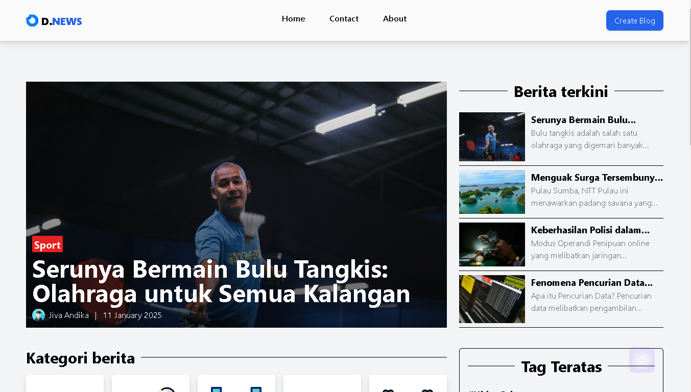

  

&nbsp;

# 🌟 Welcome to My Blog Website

Explore the perfect combination of content management, interactivity, and responsive design! This blog website is crafted to deliver a seamless blogging experience using **PHP**, **jQuery**, **Tailwind CSS**, and **Bootstrap**.

---

## ✨ Features That Make It Shine

### 👀 **Clean and Modern Look:**

Using an organized layout with neutral colors, it gives a professional and easy-to-understand impression.

### 📝 **Focus on Headlines:**

Main articles are highlighted with large images and striking titles, grabbing the user's attention.

### 💻 **Responsive Design**

Tailored for any device using the power of Tailwind CSS and Bootstrap for consistent and modern layouts.

### 🔍 **Popular Categories and Tags:**

The bottom section is designed to display frequently used news categories and tags, making content exploration easy.

### 🔐 **Secure and Reliable**

Built with security in mind, including form validation and input sanitization.

---

## 🚀 Technologies Behind the Scenes

| Technology       | Purpose                                 |
| ---------------- | --------------------------------------- |
| **PHP**          | Backend logic and server-side scripting |
| **jQuery**       | Enhancing interactivity and animations  |
| **Tailwind CSS** | Utility-first CSS framework for styling |
| **Bootstrap**    | Responsive grid and components          |

---
